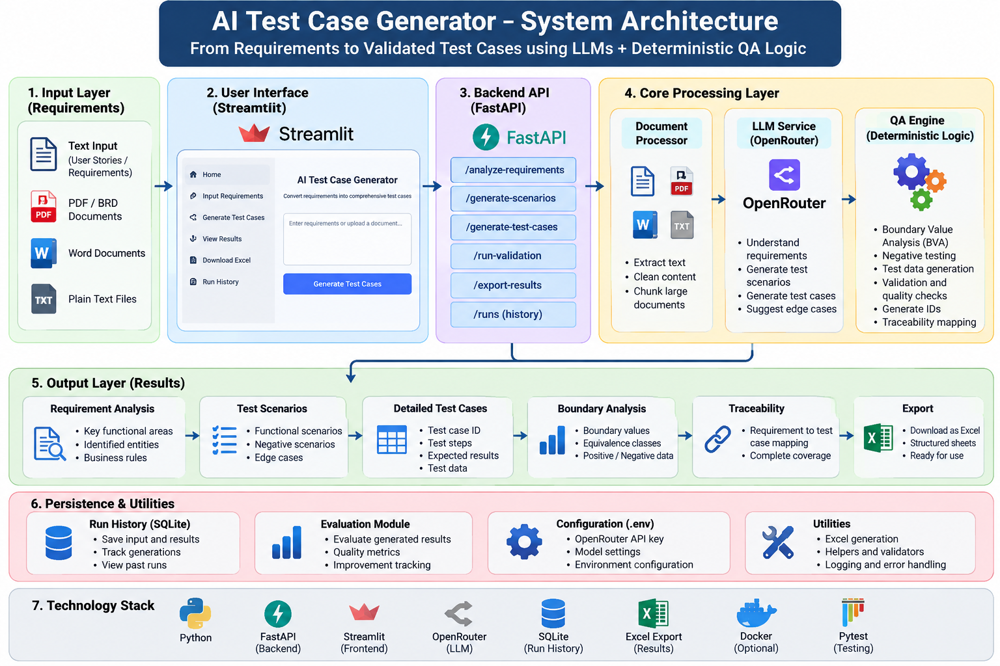
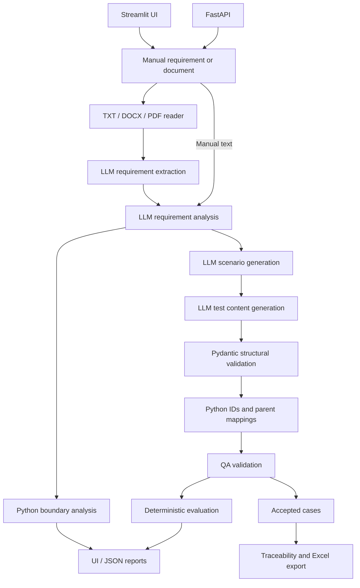

# TestGen AI

AI-assisted requirement analysis and test generation for quality engineering.
Turn a user story or BRD into structured analysis, functional/negative/boundary
scenarios, detailed test cases and an Excel traceability matrix.

## Why this project?

Language models can generate plausible but incomplete, duplicated or unsupported
tests. TestGen AI separates language understanding from deterministic QA logic:
models extract meaning and draft content; Python owns identifiers, integer boundary
calculations, structural validation, traceability and quality metrics. These checks
reduce specific failure modes, but do not guarantee semantically correct output.

## Features

- Manual requirements and TXT, DOCX (including tables), text-based PDF ingestion.
- Structured analysis separating confirmed rules, missing information and assumptions.
- Functional, negative and boundary scenarios and detailed test cases.
- Per-run deterministic IDs and inclusive integer BVA with a step of one.
- QA validation, exact duplicate-title detection and rejected-case reporting.
- Four-sheet Excel export: Requirements, Scenarios, Test Cases and Traceability.
- Completeness, traceability and duplicate metrics, plus golden-dataset evaluation.
- Streamlit UI and independent FastAPI endpoints with Swagger documentation.
- Docker was unavailable during implementation, so build and container execution are not yet verified.

## Architecture

 


The UI calls Python services directly; FastAPI does not need to run for Streamlit.
File upload through FastAPI extracts requirements only. It does not automatically
run generation or export. Model responses at each AI stage are Pydantic-validated.

## Technology

Python 3.14 (tested), OpenRouter through the OpenAI-compatible SDK, Pydantic,
FastAPI/Uvicorn, Streamlit, openpyxl, pypdf and python-docx. Docker packaging uses
the same Python major/minor version. `requirements.txt` freezes the installed
environment; `requirements.in` lists direct dependencies for maintenance.

## Local setup

From the project root, using PowerShell:

```powershell
python -m venv .venv
.\.venv\Scripts\python.exe -m pip install -r requirements.txt
Copy-Item .env.example .env
```

Copy the example only for a new setup; do not overwrite an existing `.env`.
Edit `.env` locally and set `OPENROUTER_API_KEY`. `OPENROUTER_MODEL` defaults to
`openrouter/free`; availability and provider limits can change. No API key is needed
for automated tests. Submitted requirement/document text is sent to OpenRouter.

Start the UI:

```powershell
.\.venv\Scripts\python.exe -m streamlit run ui/streamlit_app.py
```

Open http://localhost:8501. Upload `sample_documents/login_brd.txt` or enter a
requirement, click Generate, review QA results and download the workbook. The UI
processes only the first two extracted requirements. Results persist across reruns;
changing input clears them. Temporary files are isolated and cleaned up.

Start the API separately:

```powershell
.\.venv\Scripts\python.exe -m uvicorn api.main:app --reload
```

Open http://127.0.0.1:8000/docs. This MVP has no authentication; use the default
loopback binding for local development.

| Endpoint | Behavior |
| --- | --- |
| GET `/health` | Liveness; no provider request |
| POST `/analyze-requirement` | Structured analysis |
| POST `/generate-scenarios` | Analysis and scenarios |
| POST `/generate-test-cases` | Full pipeline, QA/BVA/evaluation reports |
| POST `/upload-document` | Extract requirements from multipart `file` |

Text endpoints accept `{"requirement":"Password must contain 8 to 20 characters"}`.
Input requires five characters after trimming. Invalid input returns 422; invalid
uploads 400; uploads over 10 MiB 413; provider or model-output failures 502.
Completed QA reports return 200 even when some generated cases were rejected.

## Command-line workflows

```powershell
.\.venv\Scripts\python.exe app.py
.\.venv\Scripts\python.exe app.py --requirement "Password must contain 8 to 20 characters" --output output/result.json
.\.venv\Scripts\python.exe app.py --document sample_documents/login_brd.txt --output output/brd.json
.\.venv\Scripts\python.exe document_pipeline.py --document sample_documents/login_brd.txt --output output/TestGen_Output.xlsx
```

`app.py --file` reads a UTF-8 file as one requirement. `app.py --document` extracts
requirements and processes only the first. `document_pipeline.py` processes the
first two with shared IDs and exports Excel. Default Excel filename is
`TestGen_Output.xlsx`. Existing output files are overwritten; close them in Excel
before exporting again. Rejected cases are excluded from Excel and retained in
pipeline reports. CLI QA failures return exit code 1 after reporting results.

## Testing and evaluation

```powershell
.\.venv\Scripts\python.exe -m unittest discover -s tests -v
.\.venv\Scripts\python.exe -m pip check
.\.venv\Scripts\python.exe test_evaluator.py
.\.venv\Scripts\python.exe run_evaluation.py --output output/evaluation.json
```

Regression tests use mocked AI responses and exercise actual document readers,
Excel creation/reopening, API requests and Streamlit interactions. The duplicate
demo is offline. The golden runner makes live model requests for three versioned
examples: password length, login with no limits, and a maximum-only upload size.
It records expected/actual constraints, model, timestamp, failures and scores.
Live accuracy has not been measured as part of packaging.

Suite metrics include accepted and rejected schema-valid cases. Completeness checks
nonblank titles, steps and expected results; traceability checks Python-assigned
scenario/requirement mappings; duplicates are exact normalized titles. Golden
boundary-extraction accuracy checks extracted limits, not boundary coverage in tests.
Three passing examples would mean 3/3 on dataset v1, not general AI accuracy.

## Docker

```powershell
docker compose up --build
```

Open http://localhost:8501. Compose starts PostgreSQL, FastAPI, one durable worker,
and Streamlit. Both published ports bind to localhost because run history has no
user authentication yet. The shared volume stores uploads, result JSON, and Excel
workbooks under UUID directories.

Treat this release as a trusted single-user or trusted-network deployment. Every API
client can list and download every saved run. Uploaded documents and generated files
remain in the database/`output/runs` volume because no retention or delete endpoint is
implemented yet. Configure backups and manual retention for production data. The
Compose volume is single-host storage; a multi-host deployment needs shared object
storage before workers can safely move between hosts.

For local development without Docker, SQLite is the zero-setup default. Start these
three processes in separate terminals:

```powershell
.\.venv\Scripts\python.exe -m uvicorn api.main:app --reload
.\.venv\Scripts\python.exe -m runs.worker
.\.venv\Scripts\python.exe -m streamlit run ui/streamlit_app.py
```

Set `DATABASE_URL` to a SQLAlchemy PostgreSQL URL for shared deployment, and set
`TESTGEN_API_URL` if the UI cannot reach `http://127.0.0.1:8000`. A submitted job's
UUID is stored in the page URL. The worker continues after the browser closes;
refreshing restores its status, saved JSON results, and Excel download. Network
retries use an idempotency key and resolve to the same job.

An interrupted worker heartbeat is marked failed after `WORKER_STALE_MINUTES`
(default 30). It is deliberately not auto-retried because AI calls may already have
incurred cost; submit a new run explicitly. Redis is deferred until scheduling or
throughput needs exceed this database-backed queue. Individual AI-stage checkpoints
are not implemented.

The image excludes `.env`, runs as a non-root user, and uses service-specific health
checks. Docker was unavailable during implementation, so build and container execution
are **not yet verified**.
See [release checklist](docs/release-checklist.md) for validation and GitHub steps.

## Project map

| Location | Responsibility |
| --- | --- |
| `services/`, `prompts/`, `models/` | Model calls, document/Excel IO, structured contracts |
| `qa_engine/`, `utils/` | QA validation, BVA, IDs |
| `evaluation/`, `run_evaluation.py` | Deterministic metrics and golden examples |
| `api/`, `ui/` | HTTP interface and Streamlit frontend |
| `tests/` | Automated regression tests |
| Root `test_*.py` | Component verification and development test scripts; some make live API calls |
| `sample_documents/` | Synthetic BRD for demonstrations |

## Limits and future work

No OCR, large-document chunking, authentication, test execution,
semantic duplicate detection, hallucination scoring or automatic boundary-coverage
validation. IDs reset each run/request. BVA supports inclusive integer ranges;
one-sided constraints are recorded without inventing the missing bound. Excel
Covered means an accepted case exists, not that a requirement has passed testing.

Potential follow-ups: authentication and per-user ownership, stage checkpoints,
object storage, Redis scheduling at higher throughput, a broader golden dataset,
large-document retrieval, and Jira/OpenAPI integrations.

## Portfolio and release status

[Interview explanation and resume bullets](docs/portfolio.md) describe implemented
capabilities without unmeasured accuracy or deployment claims. [Screenshot guide](docs/images/README.md)
lists actual captures to add; no screenshots are fabricated or linked before they
exist. 

Local code and release configuration are prepared. Docker build/run, actual UI
screenshots, live-model evaluation and GitHub publication remain release checkpoints.
Git/Docker tools were not available, and a GitHub destination has not been provided.
